# SariCoach: Retail AI Agent for Micro-Enterprises 🏪

[](https://agents-intensive-saricoach.vercel.app)
[](https://github.com/jgtolentino/saricoach-retail-insights/actions/workflows/sanity-check.yml)

> **Winner/Submission for [Hackathon Name]**
>
> SariCoach is a "Pocket Intelligence" layer for Sari-Sari stores (micro-retailers). It transforms raw transaction data into actionable, plain-English advice using multimodal AI agents.

-----

## 🏗️ Hybrid Cloud Architecture

SariCoach uses a robust **Hybrid Deployment Strategy** to overcome serverless limitations and deliver real-time AI insights.

```mermaid
graph LR
    User[📱 Mobile User] -->|HTTPS| Vercel[⚡ Vercel Edge]
    subgraph "Secure Proxy Layer"
        Vercel -->|Rewrite Rule| DO[🌊 DigitalOcean Droplet]
    end
    
    subgraph "Backend Core (8GB RAM)"
        DO -->|FastAPI| Agent[🤖 Coach Agent]
        Agent -->|RAG Context| DB[(🗄️ Supabase)]
        Agent -->|Reasoning| Gemini[✨ Google Gemini]
    end
```



  * **Frontend:** React (Vite) hosted on **Vercel** for global edge caching.
  * **Secure Proxy:** Vercel Rewrites tunnel API requests to the backend, solving Mixed Content (HTTPS/HTTP) issues without complex SSL setup.
  * **Backend:** FastAPI hosted on a **DigitalOcean Droplet** (8GB RAM) to handle heavy dataframes and AI logic that exceeds serverless limits.
  * **Data:** **Supabase** (PostgreSQL) with Connection Pooling (Port 6543) for high-concurrency writes.

-----

## ❓ Problem Statement

Sari-sari stores are the last mile of FMCG distribution in the Philippines, but they still run on gut feel and paper notebooks. They face three structural problems:

1) **No analytics.** They have transaction history but no way to see patterns like peak hours, bestsellers, or stock-outs.
2) **No affordable ERP.** Enterprise-grade ERPs and BI dashboards are too complex and expensive for tiny shops.
3) **No time to be an analyst.** Owners are on their feet all day; they need direct “do this next” guidance, not dashboards.

SariCoach delivers enterprise-grade intelligence on a single mobile screen through a conversational coach, using the same data models a big retailer would use.

## 🤝 Why Agents

A static dashboard is not enough for this audience:

* Store owners cannot explore dozens of charts and translate them into actions while running their shop.
* Data sources are multimodal: structured sales, synthetic shelf-vision events, STT transcripts, weather, and foot traffic. A single prompt/response model becomes brittle.

Agents solve this by splitting responsibilities:

* **PlannerAgent** interprets the goal (analyze store, explain brand, 7-day plan) and decides what data/tools to call.
* **DataAnalystAgent** builds a unified feature frame per store/brand/day from transactions, shelf events, STT events, weather, and traffic.
* **CoachAgent** (Gemini) converts those metrics into 3–7 prioritized, human-readable actions, risks, and opportunities.

This mirrors how a consulting team would work (analyst → strategist → coach) and aligns with the project’s tool-calling/orchestration focus.

## 🏗️ What We Built (Live submission + optional offline)

The **judged submission is the live deployment** that you can open right now. An offline/Kaggle path exists purely for reproducibility and mirrors the live schema, but is not the primary deliverable.

* **Live backend + mobile dashboard (production-style mode):**
  * **Backend:** FastAPI service (`service/`) deployed to the DigitalOcean droplet at `188.166.237.231:8000`, fronted by Vercel rewrites (`vercel.json`).
  * **Data backends (switchable):** `CSVBackend` reads `data/processed/*.csv` (offline/Kaggle), while `SupabaseBackend` reads the managed Postgres database seeded via `supabase/seed/seed_saricoach.sql`. Runtime selection is controlled by `SARICOACH_DATA_BACKEND=csv|supabase`.
  * **Agentic layer:** Inside the service, the Planner/DataAnalyst/Coach agents use Gemini (Google AI SDK). Before each call, the Planner fetches KPIs and feature vectors and injects them into the Coach’s context (RAG-style).
  * **Frontend:** Mobile-first React + Vite + shadcn UI in `dashboard/`, deployed on Vercel at https://agents-intensive-saricoach.vercel.app with API requests proxied to the droplet.

* **Kaggle / Offline mode (for reproducibility):**
  * `seed_saricoach_data.py` turns Kaggle-style retail CSVs into canonical multimodal tables under `data/processed/` (brands, products, stores, transactions, shelf events, STT events, weather, foot traffic).
  * `01_demo_saricoach.ipynb` loads these tables, builds the feature frame, runs the multi-agent loop on sample stores, and reports “actionability” and “groundedness” scores on synthetic scenarios.

## 🎬 Demo Experience

* **Notebook demo (offline/judging-friendly):** Runs the seed script or uses `data/processed/`, does quick EDA, executes the Planner → DataAnalyst → Coach loop on a sample store, and prints a compact 7-day action plan. The evaluation harness scores actionability and groundedness on synthetic scenarios.
* **Live API + dashboard:** The home tab shows KPIs and a volume trend for the current store. An error state appears if the API is down or Supabase isn’t reachable. “Ask SariCoach” triggers the CoachAgent to fetch metrics from Supabase, call Gemini with those metrics embedded, and return grounded recommendations (e.g., “You risk a stockout on Brand X in 2 days; increase order quantity by 30% and move it to eye level.”).

## 🏗️ Build Notes

Key course concepts applied:

* **Multi-agent orchestration:** PlannerAgent → DataAnalystAgent → CoachAgent loop.
* **Tool-calling & context engineering:** DataAnalystAgent calls data backends only; CoachAgent uses structured KPI/feature context to keep outputs grounded.
* **Evaluation & safety:** `scenarios_eval.jsonl` powers an evaluation harness; the notebook includes safety notes (no PII, no financial guarantees, “you are the decision-maker”).

Tech stack:

* **Language:** Python (FastAPI, Pandas, Pydantic), TypeScript (React/Vite).
* **Models:** Google Gemini via the official Google AI SDK.
* **Data:** Supabase (PostgreSQL) + CSV fallback.
* **Infra:** Frontend on Vercel with rewrite proxy to the droplet backend; backend on a DigitalOcean droplet sized for dataframe workloads.

## ➡️ If We Had More Time

Future enhancements (not yet implemented in this deployment):

* On-device “nano” mode for offline/basic recommendations on low-cost Android devices.
* Replace synthetic shelf vision and STT with lightweight detection and Whisper-style pipelines tuned for Filipino/Taglish.
* Reward learning from outcomes to refine the CoachAgent prompt and heuristics based on which recommendations are followed.
* Tighter Odoo 18 CE / OCA integration so stores can graduate into full ERP while keeping the same AI coach.

-----

## 🚀 Key Features

  * **📊 Real-Time Dashboard:** "Square-style" visualization of revenue, volume, and traffic trends.
  * **🧠 Context-Aware Coach:** The AI doesn't just chat; it *sees* your store's data. It knows your sales are down 5% before you ask.
  * **🛡️ Fail-Safe Data Layer:** Automatically switches between "Live Database" mode and "Kaggle/CSV" mode for resilience.

-----

## 🛠️ Quick Start (Local Dev)

**1. Clone the Repo**

```bash
git clone https://github.com/jgtolentino/saricoach-retail-insights.git
cd saricoach-retail-insights
```

**2. Backend Setup**

```bash
cd service
python -m venv venv
source venv/bin/activate
pip install -r requirements.txt
uvicorn app.main:app --reload
# Backend is now live at localhost:8000
```

**3. Frontend Setup**

```bash
cd dashboard
npm install
npm run dev
# Frontend is now live at localhost:5173
```

**4. Refresh today's demo data in Supabase**

If the home dashboard shows zeros, run the helper script to inject fresh data for
today (uses `SARICOACH_DATABASE_URL` from `service/.env`).

```bash
python reset_demo_data.py
```

-----

## 🔧 Troubleshooting & Diagnostics

If you are a judge running this locally, here is how to fix common issues:

| Symptom | Likely Cause | Fix |
| :--- | :--- | :--- |
| **Red "Failed to load" box** | Backend is offline or CORS issue | Ensure `uvicorn` is running on port 8000. Check console for "Connection Refused". |
| **"Coach Unreachable"** | Missing API Key | Ensure `SARICOACH_GOOGLE_API_KEY` is set in `service/.env`. |
| **Database Timeout** | IPv4/IPv6 mismatch | Use the **Supabase Pooler URL** (Port 6543), not the Direct Connection (Port 5432). |
| **Mixed Content Error** | HTTPS Frontend talking to HTTP Backend | Use the Vercel Production link (which has the Proxy fix) instead of mixing local/prod URLs. |

-----

## 📂 Project Structure

```text
saricoach/
├── .github/              # CI/CD Workflows (Green Badge)
├── dashboard/            # React Frontend (ShadCN UI + Recharts)
├── service/              # FastAPI Backend + Gemini Agent
│   ├── app/routers/      # API Endpoints (Store, Coach)
│   └── backend/          # Pluggable Data Layer (Supabase/CSV)
├── data/                 # Raw Kaggle Datasets & Seed Scripts
└── vercel.json           # Production Proxy Configuration
```

-----

## 🎥 Demo Video

[Click here to watch the walkthrough](https://www.google.com/search?q=%5BYOUR_YOUTUBE_LINK%5D)

-----

### 🏁 Final Pre-Submission Checklist

You are ready. Do these last 3 things:

1.  **Repo Settings:** Go to GitHub -\> Settings. Ensure "Visibility" is **Public** so judges can see it.
2.  **About Section:** On the main repo page, click the "Gear" icon on the right (About).
      * **Website:** Paste your Vercel URL (`https://agents-intensive-saricoach.vercel.app`).
      * **Topics:** Add `hackathon`, `ai-agent`, `supabase`, `fastapi`, `react`.
3.  **Submission Form:** When asked for "Deployment URL," give the **Vercel** link. When asked for "Repo," give the **GitHub** link.
