# SariCoach: Retail AI Agent for Micro-Enterprises 🏪

[](https://agents-intensive-saricoach.vercel.app)
[](https://github.com/jgtolentino/saricoach-retail-insights/actions/workflows/sanity-check.yml)

> **Winner/Submission for [Hackathon Name]**
>
> SariCoach is a "Pocket Intelligence" layer for Sari-Sari stores (micro-retailers). It transforms raw transaction data into actionable, plain-English advice using multimodal AI agents.

-----

## 🏗️ Hybrid Cloud Architecture

SariCoach uses a robust **Hybrid Deployment Strategy** to overcome serverless limitations and deliver real-time AI insights.

```mermaid
graph LR
    User[📱 Mobile User] -->|HTTPS| Vercel[⚡ Vercel Edge]
    subgraph "Secure Proxy Layer"
        Vercel -->|Rewrite Rule| DO[🌊 DigitalOcean Droplet]
    end
    
    subgraph "Backend Core (8GB RAM)"
        DO -->|FastAPI| Agent[🤖 Coach Agent]
        Agent -->|RAG Context| DB[(🗄️ Supabase)]
        Agent -->|Reasoning| Gemini[✨ Google Gemini]
    end
```



  * **Frontend:** React (Vite) hosted on **Vercel** for global edge caching.
  * **Secure Proxy:** Vercel Rewrites tunnel API requests to the backend, solving Mixed Content (HTTPS/HTTP) issues without complex SSL setup.
  * **Backend:** FastAPI hosted on a **DigitalOcean Droplet** (8GB RAM) to handle heavy dataframes and AI logic that exceeds serverless limits.
  * **Data:** **Supabase** (PostgreSQL) with Connection Pooling (Port 6543) for high-concurrency writes.

-----

## 🚀 Key Features

  * **📊 Real-Time Dashboard:** "Square-style" visualization of revenue, volume, and traffic trends.
  * **🧠 Context-Aware Coach:** The AI doesn't just chat; it *sees* your store's data. It knows your sales are down 5% before you ask.
  * **🛡️ Fail-Safe Data Layer:** Automatically switches between "Live Database" mode and "Kaggle/CSV" mode for resilience.

-----

## 🛠️ Quick Start (Local Dev)

**1. Clone the Repo**

```bash
git clone https://github.com/jgtolentino/saricoach-retail-insights.git
cd saricoach-retail-insights
```

**2. Backend Setup**

```bash
cd service
python -m venv venv
source venv/bin/activate
pip install -r requirements.txt
uvicorn app.main:app --reload
# Backend is now live at localhost:8000
```

**3. Frontend Setup**

```bash
cd dashboard
npm install
npm run dev
# Frontend is now live at localhost:5173
```

**4. Refresh today's demo data in Supabase**

If the home dashboard shows zeros, run the helper script to inject fresh data for
today (uses `SARICOACH_DATABASE_URL` from `service/.env`).

```bash
python reset_demo_data.py
```

-----

## 🔧 Troubleshooting & Diagnostics

If you are a judge running this locally, here is how to fix common issues:

| Symptom | Likely Cause | Fix |
| :--- | :--- | :--- |
| **Red "Failed to load" box** | Backend is offline or CORS issue | Ensure `uvicorn` is running on port 8000. Check console for "Connection Refused". |
| **"Coach Unreachable"** | Missing API Key | Ensure `SARICOACH_GOOGLE_API_KEY` is set in `service/.env`. |
| **Database Timeout** | IPv4/IPv6 mismatch | Use the **Supabase Pooler URL** (Port 6543), not the Direct Connection (Port 5432). |
| **Mixed Content Error** | HTTPS Frontend talking to HTTP Backend | Use the Vercel Production link (which has the Proxy fix) instead of mixing local/prod URLs. |

-----

## 📂 Project Structure

```text
saricoach/
├── .github/              # CI/CD Workflows (Green Badge)
├── dashboard/            # React Frontend (ShadCN UI + Recharts)
├── service/              # FastAPI Backend + Gemini Agent
│   ├── app/routers/      # API Endpoints (Store, Coach)
│   └── backend/          # Pluggable Data Layer (Supabase/CSV)
├── data/                 # Raw Kaggle Datasets & Seed Scripts
└── vercel.json           # Production Proxy Configuration
```

-----

## 🎥 Demo Video

[Click here to watch the walkthrough](https://www.google.com/search?q=%5BYOUR_YOUTUBE_LINK%5D)

-----

### 🏁 Final Pre-Submission Checklist

You are ready. Do these last 3 things:

1.  **Repo Settings:** Go to GitHub -\> Settings. Ensure "Visibility" is **Public** so judges can see it.
2.  **About Section:** On the main repo page, click the "Gear" icon on the right (About).
      * **Website:** Paste your Vercel URL (`https://agents-intensive-saricoach.vercel.app`).
      * **Topics:** Add `hackathon`, `ai-agent`, `supabase`, `fastapi`, `react`.
3.  **Submission Form:** When asked for "Deployment URL," give the **Vercel** link. When asked for "Repo," give the **GitHub** link.
