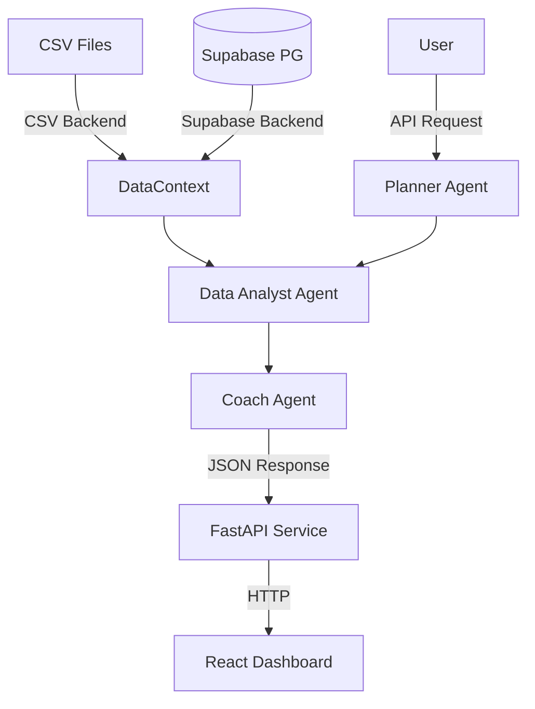

# System Architecture

## Overview

SariCoach is a dual-backend system designed to run both in offline Kaggle environments (CSV-based) and production environments (Supabase-based).

## Components

### 1. Data Layer
- **CSV Mode**: Reads processed CSVs from `data/processed/`. Used for Kaggle submissions and local demos.
- **Supabase Mode**: Connects to a Postgres database via `DATABASE_URL`. Used for production deployment.

### 2. Core Logic (`saricoach/`)
- **DataContext**: Unified data interface abstracting the backend.
- **Feature Frame**: Builds temporal features (sales, shelf vision, STT, weather) per store/brand.
- **Agents**:
    - `PlannerAgent`: Routes user intent to specific flows.
    - `DataAnalystAgent`: Computes metrics and aggregates data.
    - `CoachAgent`: Generates actionable insights and recommendations.

### 3. API Service (`service/`)
- **FastAPI**: Provides REST endpoints for the frontend.
- **Dependencies**: Injects the appropriate `DataContext` based on `SARICOACH_DATA_BACKEND`.

### 4. Frontend (`dashboard/`)
- **React + Vite**: Mobile-first dashboard.
- **Material 3**: Design system implementation.
- **Playwright**: End-to-end testing.

## Diagram

