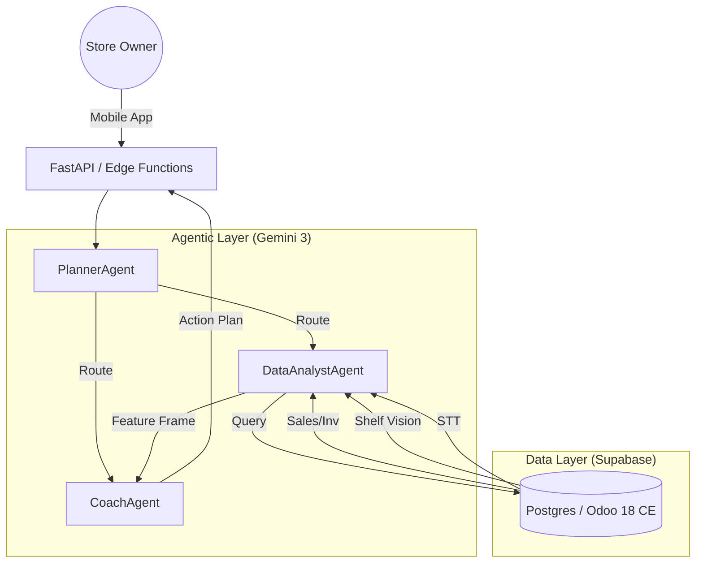

# Spec – 001 SariCoach Agent

## 1. Problem & Context

Sari-sari store owners manage:

*   **Limited shelf space**.
*   **Volatile demand**.
*   **Thin margins**.
*   **Sparse, noisy data** encompassing sales, inventory, foot traffic, weather, and customer conversations (STT).
*   They **rarely have access to analytics**.

SariCoach aims to provide these owners with **simple, actionable coaching** by leveraging multimodal inputs, including sales and inventory data, shelf vision brand detection, Speech-to-Text (STT) brand mentions, and environmental factors like weather and foot traffic.

---

## 2. Goals & Success Metrics

#### Goals

*   Provide **brand- and store-level insights** that combine Shelf visibility, Stock levels, STT demand signals, and Weather and foot traffic data.
*   Generate **plain-language recommendations** for the next 7 days.

#### Success Metrics (Internal Evaluation)

The submission must demonstrate evaluation rigor.

*   Internal eval:
    *   **≥ 0.8 average “actionability” score** across synthetic scenarios.
    *   **≥ 0.8 average “data-groundedness” score** (recommendations must be traceable to the analyzed data features).
*   Qualitative:
    *   Recommendations must be clear, short, and realistic for sari-sari owners.

---

## 3. System Architecture

### 3.1 High-Level Diagram



### 3.2 Tech Stack
- **ERP**: Odoo 18 CE + OCA (Inventory, Sales)
- **Backend**: Supabase (Postgres, Auth, Edge Functions)
- **AI**: Google Gemini 3 (Reasoning & Coaching)
- **Integration**: Python (Pandas for feature engineering)

---

## 4. Users & Personas

*   **Primary**: Sari-sari store owner or manager.
    *   *User Constraints:* Limited time and analytics background; needs short, direct recommendations.
*   **Secondary**: Data or AI practitioner evaluating the capstone project.

---

## 4. Core User Flows

The agent must support the following primary interactions:

1.  **Analyze my store today:**
    *   Input: `store_id`, date or date range.
    *   Output: Short summary of performance, risks, and opportunities.
2.  **Explain this brand:**
    *   Input: `store_id`, `brand_id`.
    *   Output: Correlation view showing how shelf visibility, stock, STT, weather, and traffic correlate with sales.
3.  **Get a 7-day action plan:**
    *   Input: `store_id` (with optional focus, e.g., “beverages”).
    *   Output: Prioritized actions for ordering, shelf layout, and promotions.

---

## 6. Functional Requirements (FR)

The system must employ a multi-agent architecture with orchestration.

*   **FR1: PlannerAgent Orchestration:** The `PlannerAgent` must orchestrate calls to the `DataAnalystAgent` and the `CoachAgent`.
*   **FR2: DataAnalystAgent Logic:** The `DataAnalystAgent` must call tools to load store and brand data, build a comprehensive feature frame combining Shelf vision, Inventory, Sales, STT features, and Weather and traffic, and run correlation/regression analysis (with optional cross-correlation for STT vs sales).
*   **FR3: CoachAgent Generation:** The `CoachAgent` must transform the structured analytical insights generated by the `DataAnalystAgent` into 3–7 prioritized actions, 1–3 risk warnings, and 1–3 opportunity highlights, using short, clear language suitable for the store owner.
*   **FR4: Evaluation Harness:** The evaluation harness must load synthetic scenarios (`scenarios_eval.jsonl`), run the full agent loop, and produce aggregate scores and per-scenario breakdowns.

### 6.x Data Signals & Identifiers

SariCoach works on top of a small, consistent data contract. Every event is anchored to products and brands via SKU / barcode identifiers.

**Product master (minimal):**
- `product_id` – internal numeric ID
- `sku` – store-level SKU code
- `barcode` – EAN/UPC/QR or similar machine-readable code (if available)
- `brand_id` – foreign key to brand
- `brand_name`
- `category` – high-level category (e.g. Beverage, Snacks, Tobacco)
- `pack_size` – e.g. "330ml", "1L", "10s"
- `pack_type` – e.g. "bottle", "can", "sachet", "stick"

**Transaction line:**
- `transaction_id`
- `product_id` (or `sku`/`barcode`)
- `brand_id`
- `quantity`
- `price_unit`
- `subtotal`

**Shelf vision event:**
- `store_id`
- `timestamp`
- `image_id` or `image_url` (optional in capstone)
- `brand_id` or `product_id`
- `facings`
- `share_of_shelf` (0–1)
- `oos_flag` – boolean stock-out indicator
- `confidence` – 0–1 confidence for the detection

**STT brand mention:**
- `store_id`
- `timestamp`
- `brand_id` (if recognized via synonym/alias table)
- `raw_text`
- `intent_label` – e.g. `ask_price`, `searching`, `complaint`, `praise`
- `sentiment_score` – -1..1

### 5.y Brand & Packaging Knowledge (CAG)

To make detection robust across different ways people refer to products, SariCoach maintains static "cold" knowledge tables (CAG) that are loaded in-memory by the agents:

- `brand_synonyms`: maps brand IDs to common spoken variants (e.g. "Coke", "Coca-Cola", "Coke Sakto").
- `packaging_variants`: links brand/product IDs to pack sizes and types (e.g. family pack vs single-serve sachet) for better interpretation of sales and shelf metrics.
- `visual_descriptors` (optional): textual hints about packaging colors and cues that can be used to align vision detections if images are used.

For the capstone submission, these can be represented as small JSON/YAML files loaded by the notebook rather than a full database.

---

## 6. Non-Functional Requirements (NFR)

*   **Runtime:** The entire system must run end-to-end from a single Kaggle notebook (`01_demo_saricoach.ipynb`).
*   **External Dependencies:** No external services that require private credentials should be included in the submission notebook.
*   **Performance:** The runtime for a full evaluation batch (e.g., 20 scenarios) should be reasonable (e.g., within a few minutes).

### 5.z Data Generation / Seed

To ensure reproducibility and multimodal richness, the project includes a seed script `seed_saricoach_data.py` that:
1.  Ingests raw Kaggle-style CSVs (sales, orders, products).
2.  Normalizes them into the canonical SariCoach schema.
3.  Synthesizes missing signals: **Shelf Vision** (facings, share of shelf), **STT** (brand mentions), **Weather**, and **Foot Traffic**.
4.  Exports processed CSVs to `data/processed/` for the agent to consume.

---

## 7. Out of Scope

The following items are explicitly out of scope for the capstone submission:

*   Full production deployment to live sari-sari stores.
*   Payment processing, PII handling, or real user authentication flows.
*   Complex User Interface (UI); the primary interface will be the Kaggle notebook or a simple console/CLI.
*   **Real-time QR / barcode scanning UX** is out of scope; the notebook assumes that transactions already contain `product_id` / `sku` / `barcode`.
*   **Training or serving a full computer vision model** is out of scope; shelf vision metrics are simulated or pre-computed features (facings, share of shelf, OOS flag) keyed by `brand_id` / `product_id`.

---

## 8. Assumptions & Open Questions

#### Assumptions

*   We can successfully simulate or stub the required multimodal data series (Shelf vision events, STT events with brand tags, Weather, and foot traffic).
*   A simple linear model or correlation analysis is sufficient to demonstrate the required level of analytical complexity and interpretability for the capstone.

#### Open Questions

*   Should we include any simple “causal” adjustments (e.g., difference-in-differences) or stay purely correlational?
*   Do we need a minimal UI beyond the notebook (e.g., Streamlit)?

---

## 9. Data Payload Example

```json
{
  "store": {
    "id": 1,
    "name": "Sari Sari A",
    "region": "NCR",
    "city": "Quezon City"
  },
  "products": [
    {
      "product_id": 101,
      "sku": "COKE_330",
      "barcode": "4800012345678",
      "brand_id": 10,
      "brand_name": "Coca-Cola",
      "category": "Beverage",
      "pack_size": "330ml",
      "pack_type": "bottle"
    }
  ],
  "transactions": [
    {
      "id": 5001,
      "date": "2025-09-01T09:15:00",
      "lines": [
        {
          "product_id": 101,
          "brand_id": 10,
          "quantity": 2,
          "price_unit": 25.0,
          "subtotal": 50.0
        }
      ]
    }
  ],
  "shelf_vision_events": [
    {
      "store_id": 1,
      "timestamp": "2025-09-01T08:00:00",
      "brand_id": 10,
      "facings": 8,
      "share_of_shelf": 0.35,
      "oos_flag": false,
      "confidence": 0.94
    }
  ],
  "stt_events": [
    {
      "store_id": 1,
      "timestamp": "2025-09-01T08:30:00",
      "brand_id": 10,
      "raw_text": "Meron pa bang Coke Sakto?",
      "intent_label": "ask_price",
      "sentiment_score": 0.1
    }
  ]
}
```
